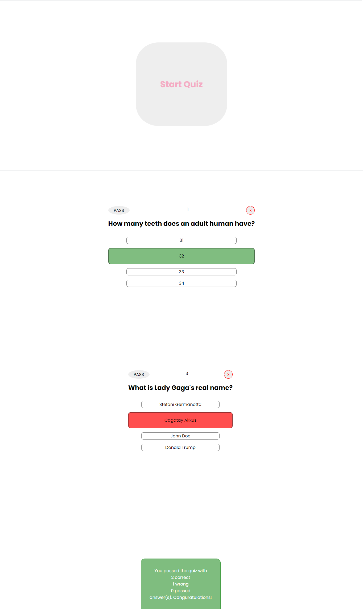

# Quiz App
This project aims to learn
* understand the redux basics such as actions, reducers, store,
* how to implement redux,
* how to separate one-piece storage into small ones,
* how to control the data flow with redux

## This is how the app looks:

## Usage
### Clone the project 
### Install packages
Execute the command `npm install` in your terminal.
### Run!
Execute the command `npm start` in your terminal.